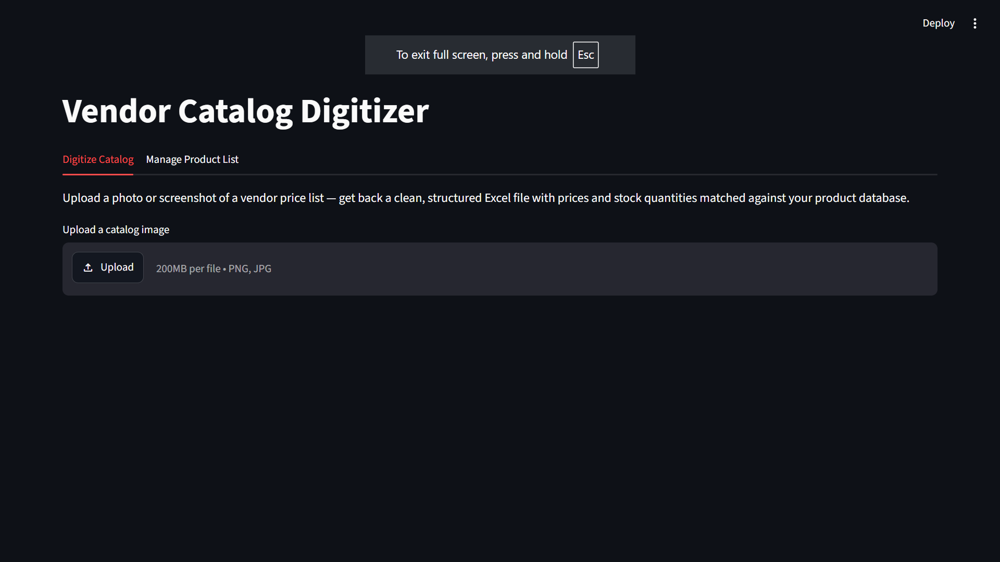
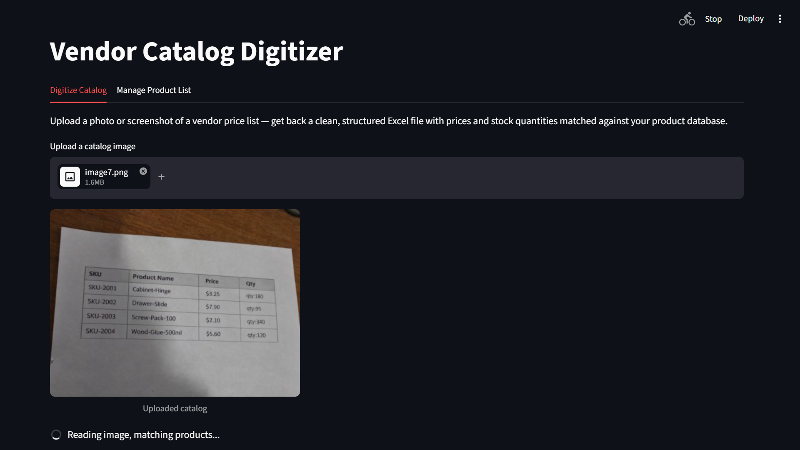
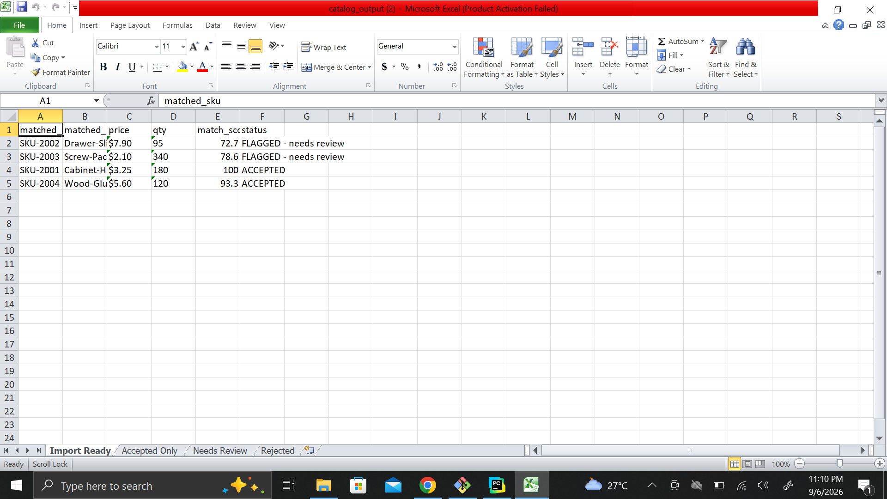

# Vendor Catalog Digitizer

An OCR-powered automation tool that converts scanned or photographed vendor price lists into clean, structured Excel data — no manual retyping required.

## The Problem

Small and mid-size distributors often receive supplier price/stock updates as scanned PDFs, phone photos, or screenshots — not as clean spreadsheets. Staff end up manually retyping every SKU, product name, price, and quantity into their inventory system, which is slow and error-prone.

## What It Does

1. **OCR extraction** — reads scanned/photographed catalog images using Tesseract
2. **Image preprocessing** — deskews rotated photos and removes noise using OpenCV before OCR, significantly improving accuracy on real-world (non-scanned) images
3. **Field parsing** — extracts SKU, product name, price, and quantity from raw OCR text
4. **Fuzzy matching** — matches extracted products against an existing product database using RapidFuzz, automatically correcting common OCR misreads (e.g. a misread SKU digit still resolves correctly via product name matching)
5. **Confidence-based routing** — high-confidence matches are auto-accepted; uncertain matches are flagged for a quick human review instead of silently risking a wrong entry
6. **Excel export** — outputs a clean, multi-tab spreadsheet ready to import into any inventory system
7. **Automated folder watching** — a background script can watch a folder and process new catalog images automatically, with no manual command needed
8. **Web interface** — a Streamlit app lets a non-technical user upload an image, view results, and download the Excel file directly in the browser, plus manage the product database without touching any code

## Tech Stack

Python · Tesseract OCR · OpenCV · RapidFuzz · pandas · Streamlit · Watchdog

## Screenshots

**1. Upload interface**


**2. Processing a catalog image**


**3. Matched results with confidence scoring**


**4. Final Excel output**


**5. Managing the product database**


## How It Works (Pipeline)
Image → OpenCV preprocessing → Tesseract OCR → Regex parsing →
RapidFuzz matching against product database → Confidence-based routing →
Excel export (Accepted / Needs Review / Rejected)

## Running Locally

```bash
pip install -r requirements.txt
streamlit run app.py
```

Requires [Tesseract-OCR](https://github.com/UB-Mannheim/tesseract/wiki) installed separately (not just the Python package).

## Project Structure
vendor-catalog-digitizer/
├── app.py # Streamlit web interface
├── pipeline.py # End-to-end processing pipeline
├── preprocess.py # OpenCV image cleanup (deskew, denoise)
├── parser.py # Extracts structured fields from OCR text
├── matcher.py # Fuzzy-matches products against master list
├── exporter.py # Excel export with confidence-based sheets
├── watch.py # Automated folder-watching mode
└── master_list/
└── master_list.csv # Reference product database

## Notes & Limitations

This is built for structured product-list style catalogs (SKU / name / price / qty). It is not a universal document parser — different document layouts would need parser adjustments or a more advanced extraction approach (e.g. LLM-based field extraction) for full flexibility.